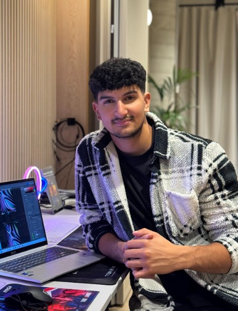

# Kabir Suri - Portfolio Website

<div align="center">
  
  
  <h3>Software Engineer & Content Creator</h3>
  <p>Building the future with code | 200K+ followers on CodingKabs</p>
  
  [](https://github.com/kabir505/Portfoliov2)
  [](https://linkedin.com/in/kabir-suri)
</div>

---

## 🚀 About Me

Hello! I'm **Kabir Suri**, a Computer Science student at King's College London passionate about building software that's efficient, impactful, and sustainable. My experience spans frontend and backend development, with hands-on roles at **TP ICAP** and **Condé Nast**, where I worked on automation tools, scalable cloud systems, and creative tech solutions.

Alongside my degree, I founded **CodingKabs** - a digital platform where I share insights on software engineering, productivity, and tech lifestyle content to over **200,000 followers**. My goal is to bridge the gap between creativity and technology while driving innovation that balances performance and sustainability.


## 🛠️ Tech Stack

This modern portfolio is built with cutting-edge technologies:

### Frontend
- **React 18** - Modern React with hooks and functional components
- **Vite** - Lightning-fast build tool and development server
- **Tailwind CSS** - Utility-first CSS framework for rapid UI development
- **Framer Motion** - Production-ready motion library for React
- **AOS (Animate On Scroll)** - Scroll animation library
- **Material UI** - React component library for consistent design

### Backend & Database
- **Supabase** - Open source Firebase alternative for backend services
- **PostgreSQL** - Robust relational database
- **Real-time subscriptions** - Live comment system

### Development Tools
- **ESLint** - Code linting and quality assurance
- **PostCSS** - CSS processing and optimization
- **Vercel** - Deployment and hosting platform

### Additional Libraries
- **Lucide React** - Beautiful & consistent icon toolkit
- **SweetAlert2** - Beautiful, responsive, customizable popup boxes
- **Lottie** - Lightweight animations for web
- **Typewriter Effect** - Typewriter animation library

## 🎯 Key Features

- ✨ **Modern Design** - Clean, responsive, and visually appealing interface
- 🚀 **Performance Optimized** - Fast loading times and smooth animations
- 📱 **Mobile Responsive** - Perfect experience across all devices
- 🎨 **Interactive Elements** - Hover effects, animations, and transitions
- 💬 **Comment System** - Real-time comments with Supabase integration
- 🏢 **Work Experience** - Detailed showcase of professional experience
- 💼 **Project Portfolio** - Comprehensive project gallery with live demos
- 🛠️ **Tech Stack Display** - Organized skills and technologies
- 📄 **CV Download** - Direct access to resume
- 🌙 **Dark Theme** - Modern dark mode design

## 📋 Prerequisites

Before running this project, ensure you have:

- **Node.js** (version 16.x or higher)
  - **npm** or **yarn** package manager
- **Git** for version control

## 🏃‍♂️ Getting Started

### 1. Clone the Repository

```bash
git clone https://github.com/kabir505/Portfoliov2.git
cd Portfoliov2
```

### 2. Install Dependencies

```bash
npm install
```

If you encounter peer dependency issues, use:

```bash
npm install --legacy-peer-deps
```

### 3. Environment Setup

Create a `.env` file in the root directory:

```env
# Supabase Configuration
VITE_SUPABASE_URL=your-supabase-project-url
VITE_SUPABASE_ANON_KEY=your-supabase-anon-key
```

### 4. Run the Development Server

```bash
npm run dev
```

### 5. Open in Browser

Access the application at `http://localhost:5173`

## 🏗️ Building for Production

    ```bash
    npm run build
    ```

The build files will be generated in the `dist` folder, ready for deployment.

## ⚙️ Supabase Configuration

This portfolio uses Supabase for backend services including project data, work experience, and comments.

### Database Setup

Run the SQL script in `supabase-setup.sql` in your Supabase SQL Editor to set up:

- **Projects table** - Portfolio projects with features and tech stack
- **Work Experience table** - Professional experience and achievements
- **Comments table** - Real-time comment system
- **Security policies** - Row-level security for data protection

### Required Tables

1. **projects** - Stores portfolio project information
2. **work_experience** - Stores professional work history
3. **portfolio_comments** - Stores user comments with real-time updates

## 🎨 Design Philosophy

This portfolio embodies my design principles:

- **Simplicity** - Clean, uncluttered interface that focuses on content
- **Performance** - Optimized for speed and smooth user experience
- **Accessibility** - Designed with all users in mind
- **Responsiveness** - Seamless experience across all devices
- **Modern Aesthetics** - Contemporary design trends and animations

## 📊 Project Structure

```
src/
├── components/          # Reusable React components
│   ├── Background.jsx   # Animated background component
│   ├── CardProject.jsx  # Project card component
│   ├── Modal.jsx        # Modal dialog component
│   ├── Navbar.jsx       # Navigation component
│   └── ...
├── Pages/              # Main page components
│   ├── Home.jsx        # Landing page
│   ├── About.jsx       # About section
│   ├── Portofolio.jsx  # Portfolio showcase
│   └── Contact.jsx     # Contact form
├── assets/             # Static assets
└── supabase.js         # Supabase client configuration
```

## 🚨 Troubleshooting

### Common Issues

1. **Dependencies not installing**
   ```bash
   npm install --legacy-peer-deps
   ```

2. **Supabase connection issues**
   - Verify your `.env` file has correct credentials
   - Ensure Supabase project is active
   - Check database tables are created

3. **Build errors**
   - Clear node_modules and reinstall
   - Check for TypeScript errors
   - Verify all imports are correct

4. **Styling issues**
   - Ensure Tailwind CSS is properly configured
   - Check for conflicting CSS classes

## 🎯 Performance Optimizations

- **Code Splitting** - Lazy loading of components
- **Image Optimization** - Optimized images and lazy loading
- **Bundle Analysis** - Minimized bundle size
- **Caching** - Efficient data caching with Supabase
- **Animations** - Hardware-accelerated CSS animations

## 📱 Mobile Optimization

- **Responsive Design** - Mobile-first approach
- **Touch Interactions** - Optimized for touch devices
- **Performance** - Reduced animations on mobile
- **Navigation** - Mobile-friendly navigation menu

## 🔒 Security Features

- **Environment Variables** - Secure API key management
- **Row Level Security** - Supabase RLS policies
- **Input Validation** - Form validation and sanitization
- **HTTPS** - Secure connections in production

## 📈 Analytics & SEO

- **Meta Tags** - Optimized for search engines
- **Open Graph** - Social media sharing optimization
- **Sitemap** - Search engine indexing
- **Performance Monitoring** - Core Web Vitals tracking

## 🤝 Contributing

While this is a personal portfolio, I welcome feedback and suggestions:

1. Fork the repository
2. Create a feature branch
3. Make your changes
4. Submit a pull request

## 📄 License

This project is open source and available under the [MIT License](LICENSE).

## 📞 Contact & Connect

<div align="center">

**Kabir Suri**

[](https://codingkabs.com)
[](https://github.com/kabir505)
[](https://linkedin.com/in/kabir-suri)
[](https://instagram.com/codingkabs)
[](mailto:kabir@codingkabs.com)

**📍 Location:** London, UK  
**🎓 Education:** King's College London - Computer Science  
**💼 Current:** Software Engineering Intern at TP ICAP  
**📺 Content:** 200K+ followers on CodingKabs

</div>

---

<div align="center">
  <p><em>"The best way to predict the future is to create it"</em></p>
  
  ⭐ If you found this portfolio helpful, please consider giving it a star on GitHub!
  
  <p>Made with ❤️ by <strong>Kabir Suri</strong></p>
</div>
